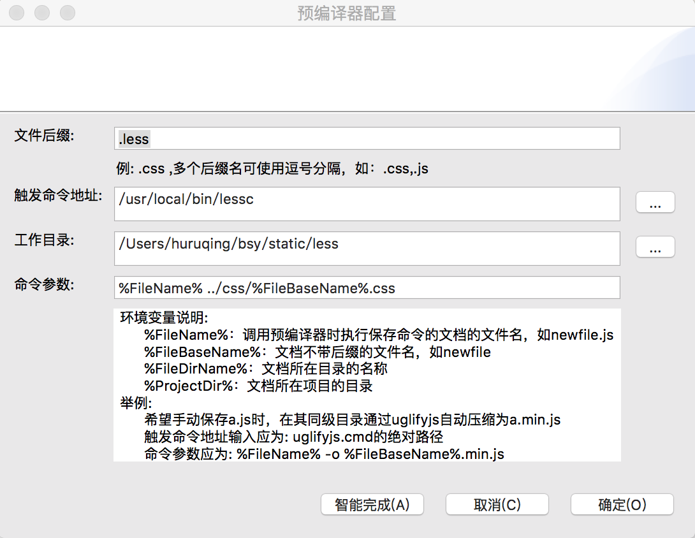

前提条件,安装好nodes,less(全局安装npm i less -g)
1,builder设置 工具 -> 预编译器设置 -> 新建 截图如下:

1) 文件后缀.less
2) 触发命令地址 -> 点击智能完成,应该就会智能把less的编译命令lessc填进来,如果没有,请手动填写lessc.cmd的地址
2) 工作目录 你的less文件所在目录
3) 命令参数 %FileName% ../css/%FileBaseName%.css 把less编译成css后放到同级的css文件夹

4) 我的项目结构截图如下:

1) demo.html引用css里面的demo.css
2) demo.less放入less文件夹

5) 自动刷新页面
* 下载包https://github.com/huruqing/static.git
* 使用shell或者命令提示符进入项目目录
* 执行nam install
* 执行gulp
* 打开http://localhost:8080/demo.html,当修改demo.less代码时,页面就会发生改变

